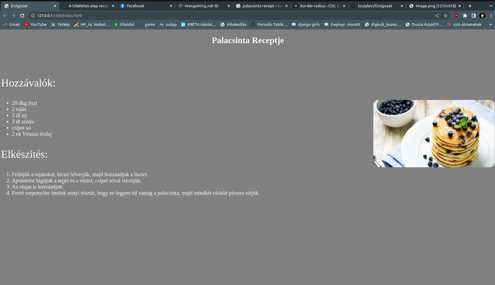

# Dolgozat - Palacsinta 🥞 recept

# Így kell kinéznie a weboldalnak ahogy a kesz_feladat_kinezete_.png -ben lehet látni.

Feladatok:

A weboldal nyelve magyar (hu) legyen!

A kis fülecske (baloldalt legfelül) neve Dolgozat legyen!

A "Palacsinta Receptje" legyen fehér szinű, középre helyezve és 1. cimsorba rakva!

Illeszen be 3 sortörést a 1. cimsor után!

A "hozzávalók" és az "elkészítés" szöveg legyen fehér és 40px nagyságú!

A háttér legyen szürke!

A lista elemek felsorolása legyen fehér szinű és 20px-es!

A kép legyen úgy lekódolva, hogy ha rávisszük az egeret kiírja, hogy palacsinta!
Továbbá legyen 20px -sen lekerekitve!
A kèp magassága legyen 250px magas és 450 px széles!
Továbbá a kép legyen jobb oldalra tolva!
A kèp alternatív szövege palacsinta legyen! (Ha nem jelenik meg a kèp akkor az alt legyen "palacsinta 🥞")

A hozzávalok felsorolásai számozatlan felsorolások legyenek az elkészités felsorolásai pedig számozottak legyenek!

# A dolgozatra 30 perc áll rendelkezésre kizárólag a w3school oldalát lehet használni! Bármilyen más weboldal, vagy kommunikációs platform használata esetén jegy levonás történik!

# jó munkát kivánok! 

